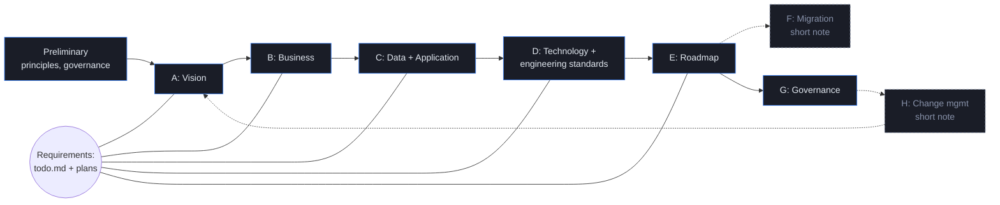
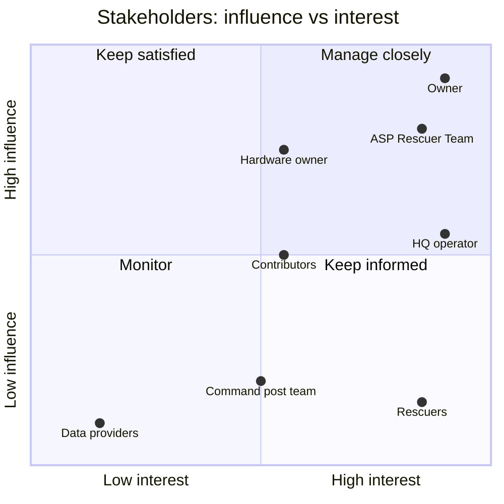
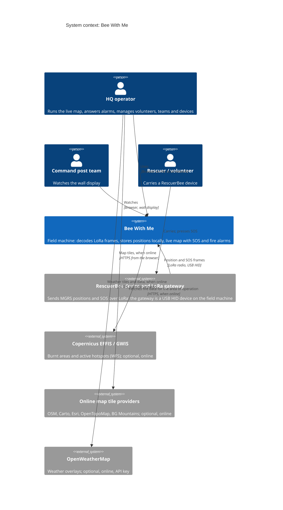
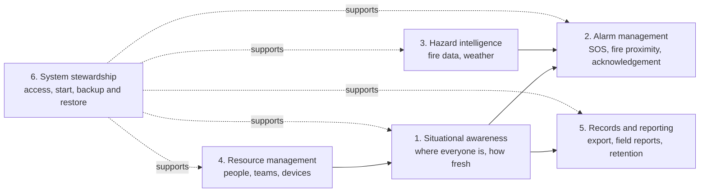
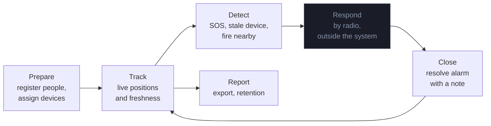
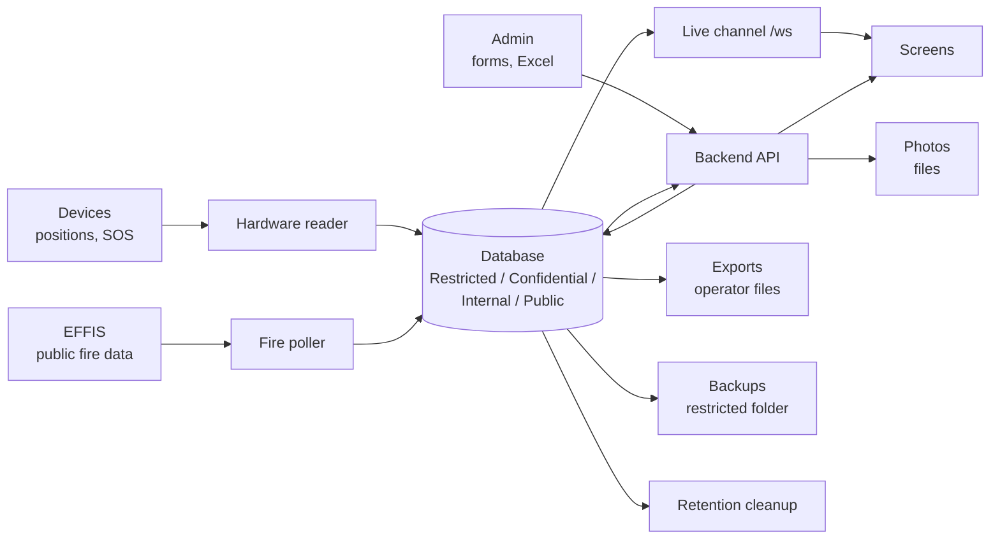
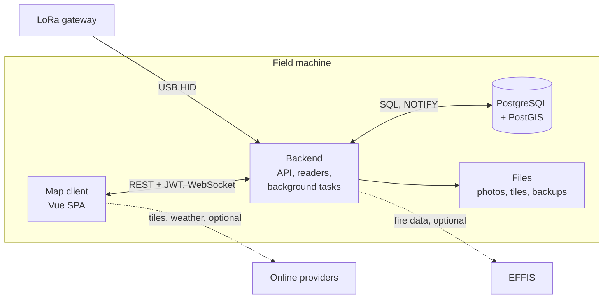
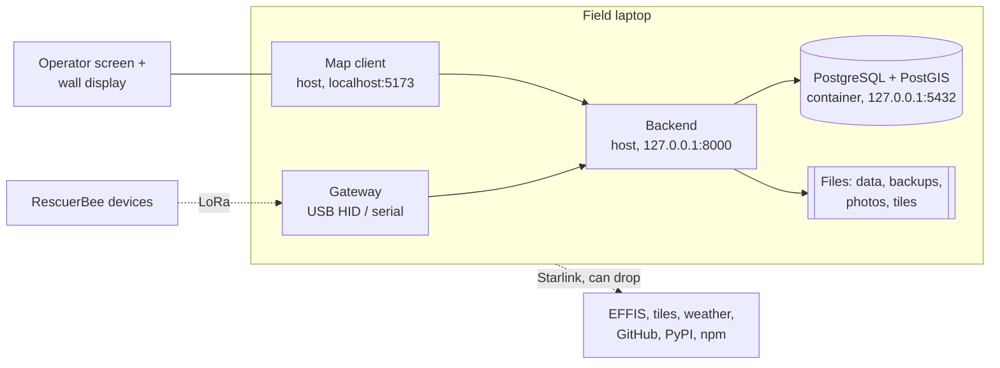

# Bee With Me architecture

**Version:** 0.5 (Preliminary, Phases A to D)
**Status:** Draft
**System version described:** 1.7.1 plus the EFFIS fire-layers work in progress
**Owner:** Project owner (kvelev)
**Last updated:** 2026-10-03

This is the stable, high-level architecture description of Bee With Me. It follows the TOGAF Architecture
Development Method (ADM), tailored to a small open-source project. Technology and vendor choices are
recorded as Architecture Decision Records (ADRs), not in this document; details that change often
(schemas, API contracts, configuration) live in separate supporting documents.

---

## 1. Preliminary: architecture capability

### 1.1 Purpose and scope of this architecture work

Bee With Me tracks people during rescue and volunteer operations where there is no internet. RescuerBee
devices radio their positions over LoRa to a gateway on a field machine; the system stores them and shows
them live on a map with SOS and (in progress) wildfire alarms.

This architecture work documents the system as built, the target state of the current roadmap (EFFIS fire
layers and proximity alarm), and the rules contributors follow when they change it. It covers one
deployment model: a single field machine on a local network, with one operator.

Out of scope: multi-site or cloud deployments, the RescuerBee device firmware and LoRa radio design, and
organisational processes of the rescue teams themselves.

### 1.2 Architecture principles

The governing principles are in [principles/architecture-principles.md](principles/architecture-principles.md):

- **Life safety (BP-01 to BP-03):** never lose a person, alarms win and persist, fail loud and fail safe.
- **Personal data (DP-01 to DP-03):** data stays on the machine, minimise and restrict, explicit lifetime.
- **Offline first (TP-01 to TP-03):** no runtime internet dependency, online sources are optional, one
  machine with a reproducible start.

When principles conflict, life safety comes first, personal data second, offline-first third.

### 1.3 Tailored ADM

The full ADM is scaled down to what a single-maintainer, single-deployment system needs.

| Phase | Depth | Where |
|-------|-------|-------|
| Preliminary | Full | This section, `principles/`, ADR 1 |
| A: Architecture Vision | Full | Section 2 |
| B: Business Architecture | Full | Section 3 |
| C: Information Systems (Data, Application) | Full | Section 4 + supporting documents |
| D: Technology Architecture, incl. engineering standards (naming, patterns, idempotency, SOLID) | Full | Section 5 + supporting documents |
| E: Opportunities & Solutions (roadmap) | Full | Section 6 |
| F: Migration Planning | Short note | Section 7 |
| G: Implementation Governance | Full | Section 8 |
| H: Architecture Change Management | Short note | Section 9 |
| Requirements Management | Continuous | `todo.md`, implementation plans |

### 1.4 Governance model

- **Approval:** the project owner approves architecture changes by merging the pull request that contains
  them. An ADR is `Proposed` while its pull request is open and `Accepted` when merged.
- **Contributors** (people working from forks and AI agents) propose changes, ADRs and documents through
  pull requests to the owner's repository. Nobody pushes directly to `main`.
- **Review gates:** before a pull request, an adversarial review and, for security-relevant changes, a
  security review must pass on the current diff (details in Section 8).
- **Decision records:** see [ADR 1](decisions/0001-record-architecture-decisions.md) and the
  [ADR index](decisions/0000-README.md).

### 1.5 Architecture repository

Everything lives in the application repository under `Architecture/`: Markdown with embedded Mermaid
diagrams, so it is readable on GitHub, reviewable in pull requests and usable by coding agents. ADRs use the
adr-tools layout so the folder can later be imported into a Structurizr C4 model. See
[README.md](README.md) for the folder map.

---

## 2. Phase A: Architecture Vision

### 2.1 Statement of architecture work

**Problem.** Rescue and volunteer teams in Bulgaria work in mountains and forests where mobile networks
and the internet are often missing. The command post needs to know where every team member is, who has
asked for help, and (during wildfires) where fires are burning relative to the teams. Commercial trackers
depend on mobile data or satellite subscriptions and send the data to a cloud.

**What the system does.** RescuerBee devices send their position over LoRa radio to one gateway plugged
into a field machine at the command post. Bee With Me decodes the frames, stores the positions locally
and shows them live on a map, with SOS alarms, team management, history export and, in progress,
Copernicus EFFIS fire data with a proximity alarm.

**Scope of this architecture.**

| In scope | Out of scope |
|----------|--------------|
| The software on the field machine: backend, database, map client, start/backup/restore scripts | RescuerBee firmware, radio design, gateway firmware |
| The interfaces to the LoRa gateway (USB HID) and to optional online data sources | The rescue organisations' own procedures |
| One deployment: one field machine on a local network, one operator, optional wall display | Multi-site, cloud or internet-facing deployments |
| The current roadmap (`todo.md`), in particular the EFFIS fire layers and alarm | Mobile apps for rescuers |

**Desired outcomes.**

1. The operator sees every person's position and its age, live, with no internet.
2. No SOS or fire alarm can be missed or lost on a page reload or restart.
3. Personal data stays on the field machine.
4. One person can install, start, back up, restore and upgrade the system on Windows or Linux.
5. Contributors, people and coding agents, can change the system without breaking the above.

### 2.2 Business drivers and goals

| ID | Driver | Goal | Principles |
|----|--------|------|------------|
| G-01 | Teams work where there is no coverage | Track people over LoRa with no internet at any point of operation | TP-01, BP-01 |
| G-02 | A missed call for help can cost a life | SOS and fire alarms that persist until acknowledged | BP-02 |
| G-03 | Wildfire operations (summer seasons) | Show burnt areas and active hotspots and warn when fire comes near HQ or rescuers | BP-02, TP-02 |
| G-04 | Volunteers trust the team with sensitive data | Keep personal data local and restricted | DP-01, DP-02 |
| G-05 | No IT staff in the field | Reproducible start, backup before every upgrade, tested restore | TP-03, BP-03 |
| G-06 | Small team of maintainers, some of them AI agents | Written principles, ADRs and engineering standards that agents can follow | ADR 1 |

### 2.3 Stakeholders

| Stakeholder | Role | Interest | Influence | Main concerns |
|-------------|------|----------|-----------|---------------|
| Project owner (kvelev) | Maintainer of the upstream repository; approves every change | High | High | Correctness in the field, maintainability, scope |
| ASP Rescuer Team (named on the app's About page, https://rescuer.team) | Operating organisation | High | High | Reliable tracking and alarms during operations |
| HQ operator | Runs the map at the command post; role `admin` | High | Medium | Clear live picture, alarms, low fatigue on long shifts |
| Command post team | Reads the wall display from across the room | Medium | Low | Legible state at a distance |
| Rescuers and volunteers | Carry RescuerBee devices; their data is stored (data subjects) | High | Low | Being found; privacy of their personal data |
| Contributors (forks, AI coding agents) | Propose changes through pull requests | Medium | Medium | Clear rules, decisions and tests |
| RescuerBee hardware owner | Device and gateway firmware, frame format | Medium | High | Frame protocol (`docs/PROTOCOL.md`), frame interval |
| External data providers (Copernicus EFFIS/GWIS, map tile providers, OpenWeatherMap) | Optional online sources | Low | Low | Fair use, attribution, API keys |

> 📝 **Assumption:** ASP Rescuer Team is the primary operating organisation. To be confirmed by the owner.

> ⚠️ **Requires stakeholder input (owner):** who owns the RescuerBee firmware and gateway, and who decides
> changes to the frame protocol.

### 2.4 System context

The browser loads online map tiles and weather data directly; the field machine fetches EFFIS data in the
background (target state). Everything else runs on the field machine.

### 2.5 Baseline and target

| Area | Baseline (1.7.1) | Target (this roadmap) | Gap closed by |
|------|------------------|-----------------------|---------------|
| Positions, SOS, teams, export | Working, live over WebSocket | Unchanged | |
| Map tiles | Street, Dark, Satellite and Topo are online only; BG Mountains has an offline mode | Every basemap the operator relies on has a local option (TP-01) | Phase E work package |
| Weather overlays | OpenWeatherMap from the browser, API key in the client bundle, sends the map centre | Optional, clearly marked as online, key not shipped to every browser (DP-01, TP-02) | Phase E work package |
| Fire data | None | EFFIS burnt areas and hotspots stored locally, freshness shown, proximity alarm | EFFIS plan, P1 to P5 |
| HQ location | Browser localStorage | Database (shared by all screens) | EFFIS plan, P3 |
| Schema changes | Manual | Numbered migrations, backup before migrate, restore scripts | Done (EFFIS P0) |
| Live channel | `/ws` open, CORS `*`, all listeners on loopback | `/ws` stays open by design; CORS restricted | [ADR 15](decisions/0015-live-channel-open-by-design.md), [ADR 12](decisions/0012-loopback-only-network-exposure.md) |

> ⚠️ **Requires stakeholder input (owner):** are the online basemaps and weather overlays used during real
> operations, or only when preparing at base? This decides how urgent the TP-01 gap is.

### 2.6 Constraints

- Runs on one field machine, Windows or Linux; macOS is not supported because of USB HID access to the
  gateway ([ADR 2](decisions/0002-single-field-machine-intranet-deployment.md)).
- Intranet only: the system is not built to be exposed to the internet.
- No internet is guaranteed at run time.
- One operator today. Only admin accounts log in; `rescuer` and `viewer` exist in the schema but are not
  used for login (owner, 2026-10-04). About ten RescuerBee devices in total, not one per volunteer.
- Infrastructure in containers (Podman first, Docker as the alternative); backend and frontend run on the
  host.
- The frame protocol is defined by the hardware (`docs/PROTOCOL.md`) and changes only with the hardware
  owner.
- User interface in Bulgarian and English.
- Volunteer maintainers; no CI/CD and no packaged release yet.

### 2.7 Success measures

| ID | Measure | Target |
|----|---------|--------|
| M-01 | Positions shown with their age; stale after 10 minutes without a frame | Always (BP-01) |
| M-02 | SOS and fire alarms survive a page reload and a backend restart and need an acknowledgement | Always (BP-02) |
| M-03 | Time from a frame reaching the gateway to the marker moving on every connected screen | ⚠️ number needed |
| M-04 | The system starts and tracks with the network cable unplugged | Always (TP-01, target state for basemaps) |
| M-05 | Upgrade with pending migrations takes a verified backup first; a restore is tested before each release | Always (TP-03, BP-03) |
| M-06 | Fire proximity alarm radius | HQ 10 km, rescuers 3 km by default, set by an admin |

> ⚠️ **Requires stakeholder input (owner):** the acceptable delay for M-03, and the expected number of
> devices per operation.

### 2.8 Assumptions

> 📝 **Assumption:** one field machine and one gateway per operation; no failover machine.

> 📝 **Assumption:** rescuers do not use the web interface themselves; they appear on it.

> 📝 **Assumption:** the RescuerBee frame interval is unknown; data-volume estimates in
> `docs/research` use a range until the hardware owner confirms it.

### 2.9 Risks

The risk register is in [governance/risk-register.md](governance/risk-register.md). The highest risks at
this stage: the field machine is a single point of failure; the live WebSocket channel is not
authenticated; several basemaps and the weather overlays need the internet.

## 3. Phase B: Business Architecture

The full capability catalogue, processes, events, rules and gap analysis are in the supporting document
[business/business-architecture.md](business/business-architecture.md). This section keeps what is stable.

### 3.1 Business scope

Bee With Me supports one activity: keeping track of people in the field during a rescue or volunteer
operation and warning the command post when one of them needs help or a fire comes near. The response to an
alarm (dispatch, talking to teams and partners) is done by people over radio, outside the system
([ADR 3](decisions/0003-alarm-response-outside-the-system.md)). The system has no record of an "operation";
one installation serves the operation under way ([ADR 4](decisions/0004-no-operation-entity.md)).

### 3.2 Capability map (level 1)

| Capability | Serves goals | Main principles |
|-----------|--------------|-----------------|
| 1. Situational awareness | G-01 | BP-01, TP-01 |
| 2. Alarm management | G-02, G-03 | BP-02 |
| 3. Hazard intelligence | G-03 | TP-02, BP-03 |
| 4. Resource management | G-01, G-04 | DP-01, DP-02 |
| 5. Records and reporting | G-04, G-05 | DP-02, DP-03 |
| 6. System stewardship | G-05, G-06 | TP-03, BP-03 |

### 3.3 Value stream

### 3.4 Organisation and actors

The HQ operator (role `admin`) registers people and devices, assigns devices before an operation, watches
the map, receives alarms and relays them by radio to teams and partner organisations. Rescuers carry
devices and appear on the map but do not use the system. The command post team reads the wall display.
Any organisation can take part in an operation, including state services such as the fire service and the
military; partners receive information by radio or phone. The admin is responsible for devices. Any
logged-in user may resolve an alarm. Operation data must be preserved after the operation. There is no data
protection officer and there are no business KPIs beyond M-01 to M-06. Personal data is processed on the
basis of the volunteer's contract with ASP, with no separate consent; special-category data such as blood type
is not covered by that basis ([ADR 16](decisions/0016-lawful-basis-asp-contract.md)).

> ⚠️ **Requires stakeholder input (owner):** whether partners see the map or receive exports; how long and
> in what form operation data is kept (it conflicts with the 90-day retention cleanup today, R-20); the lawful
> basis for blood type and for partner personnel (R-19).

### 3.5 Baseline and target

In baseline 1.7.1 the operator can track, see freshness and trails, handle SOS, manage people, teams and
devices, export and back up. The target adds fire data and the fire proximity alarm with acknowledgement
and suppression zones, a shared command post location, offline basemaps, and closes the access-control
gaps. The gap table is in the supporting document, Section 7.

## 4. Phase C: Information Systems Architectures

Details live in supporting documents: [data/domain-model.md](data/domain-model.md),
[data/data-classification.md](data/data-classification.md), [data/schema-core.md](data/schema-core.md),
[data/schema-fire.md](data/schema-fire.md), [application/application-architecture.md](application/application-architecture.md)
and [application/api-contracts.md](application/api-contracts.md).

### 4.1 Data architecture

**Entities.** Four groups: the **register** (people, teams, devices, and in the target a single settings
record), the **event stream** (positions and repeater heartbeats, append-only), **alarms** (SOS and, in the
target, fire alerts and suppression zones) and **fire data** (hotspots, field reports, burnt areas). A position
records the person who carried the device at that moment, so history survives reassignment. There is no
operation entity ([ADR 4](decisions/0004-no-operation-entity.md)).

**Store.** One PostgreSQL database with PostGIS on the field machine
([ADR 5](decisions/0005-postgresql-postgis-raw-sql.md)); photos, offline tiles, backups and exports are files.
Schema changes are numbered SQL migrations applied at start-up after a backup
([ADR 10](decisions/0010-numbered-sql-migrations.md)).

**Authoritative sources.** Devices are the source of positions and SOS; the server clock is the source of
freshness (BR-01). The admin is the source of people, teams and devices (form or Excel import). EFFIS is the
source of fire data; people are the source of field reports, dismissals and acknowledgements.

**Classification.** Restricted (health and contact data, photos, positions of people), Confidential (names,
teams, alarms), Internal (devices, configuration), Public (fire data, tiles). Every store has a reader list and
a lifetime in the classification register (DP-03).

> ⚠️ **Requires stakeholder input (owner):** classification levels, where backups are stored and whether they
> are encrypted, and how long fire data and alerts are kept (BR-09). The PIN is the volunteer's identification
> PIN, an identifier, not a secret (owner, 2026-10-04).

### 4.2 Application architecture

**Style.** A modular monolith on one machine: one backend process with the REST API, the WebSocket and all
background tasks ([ADR 6](decisions/0006-modular-monolith-in-process-tasks.md)); live updates flow through
`pg_notify` and one WebSocket ([ADR 7](decisions/0007-pg-notify-websocket-live-channel.md)); local accounts
with JWT and three roles ([ADR 8](decisions/0008-local-accounts-jwt.md)); a Vue 3 single-page app with
OpenLayers ([ADR 9](decisions/0009-vue-spa-openlayers.md)).

**Target module structure.** The code moves step by step to modules as vertical slices across backend and frontend,
with writes only by the owning module, a transactional outbox for cascades, a direct path for positions and alarms,
and architecture tests that guard the boundaries ([ADR 17](decisions/0017-vertical-slice-modules.md),
[ADR 18](decisions/0018-transactional-outbox.md), [ADR 19](decisions/0019-architecture-tests.md); details in
[application/modular-monolith.md](application/modular-monolith.md)).

**Capabilities to components.**

| Capability | Components |
|-----------|------------|
| 1. Situational awareness | Hardware readers, parser, locations API, `/ws`, map client |
| 2. Alarm management | Reader (SOS), fire alarm service (target), alert endpoints, alarm banners |
| 3. Hazard intelligence | Fire poller and fire API (target); weather in the browser |
| 4. Resource management | Users, groups, devices APIs and views |
| 5. Records and reporting | Export API, retention cleanup, field reports (target) |
| 6. System stewardship | Auth, migration runner, start/backup/restore scripts |

**Findings in Phase C, as resolved with the owner on 2026-10-04:** the PIN is the volunteer's identification
PIN, not a secret (R-21 closed); the open live channel is by design and protected by loopback binding
(R-22 accepted, [ADR 15](decisions/0015-live-channel-open-by-design.md)); only admins log in, so role-based
reads are a low risk (R-23); the serial and HID readers both start on every boot
(both stay, R-24).

**Future integrations.** Wind data comes first (wind-shift warnings), then possibly APRS and Meshtastic. Each
new source is an optional, bounded backend feed or an extra reader into the same frame processing, never a
dependency of core tracking (TP-02).

## 5. Phase D: Technology Architecture

Details live in [technology/technology-architecture.md](technology/technology-architecture.md) (catalogue,
topology, ports, operations), [technology/engineering-standards.md](technology/engineering-standards.md) (rules
`ES-01` to `ES-34`) and [technology/nfr-traceability.md](technology/nfr-traceability.md).

### 5.1 Field setup

A typical laptop (Windows or Linux) at the command post runs everything. The wall display is a monitor attached
to that laptop. Starlink is standard at every operation and gives internet that can drop at any time; it is
used for optional data (fire data, online tiles, weather) and for updates, never for core tracking.

### 5.2 Technology decisions

| Area | Decision |
|------|----------|
| Infrastructure | Database (and tile server) in containers, Podman first, Docker as the alternative; backend and map client on the host for USB access ([ADR 11](decisions/0011-containers-for-infrastructure-host-for-app.md)) |
| Network | Every listener on loopback; all screens attached to the laptop ([ADR 12](decisions/0012-loopback-only-network-exposure.md)) |
| Secrets | Local `.env`, warnings on defaults, nothing secret in the browser bundle ([ADR 13](decisions/0013-secrets-and-settings-in-env.md)) |
| Delivery | Run from a Git checkout, update with `git pull`, no packaged release or CI for now ([ADR 14](decisions/0014-run-from-source-git-pull.md)) |
| Data platform | PostgreSQL 16 + PostGIS ([ADR 5](decisions/0005-postgresql-postgis-raw-sql.md)), numbered migrations ([ADR 10](decisions/0010-numbered-sql-migrations.md)) |

### 5.3 Availability and recovery

The database container restarts by itself; the backend and the map client are development servers started by
hand (R-11). Backups are taken automatically before migrations and on demand, onto the laptop's own disk.

> ⚠️ **Requires stakeholder input (owner):** recovery time and acceptable data loss when the laptop fails during
> an operation, a spare laptop, and periodic backups to a separate drive are not defined (R-01). A proposal is in
> the technology document, Section 4.1.

### 5.4 Engineering standards

The standards document turns the principles and the existing code into checkable rules: naming (two clocks,
units in names, SQL and REST names), structure (thin routers, raw parameterised SQL, pure core with an
injected clock, one writer per fact), idempotency (migrations, upserts, store before ACK, one open alarm per
cause), SOLID as applied here, logging without personal data, and tagged test-first work.

## 6. Phase E: Opportunities & Solutions

*To be written in Phase E, after the field exercise, which is the main source of requirements for the roadmap.*

Inputs collected so far: the capability gaps (Section 3, supporting document Section 7), the risk register, and
the catalogue of future capabilities [roadmap/future-capabilities.md](roadmap/future-capabilities.md) (wind data,
APRS, Meshtastic, packaged release, operation entity, and an AI operator assistant assessed in
[roadmap/fc-01-ai-assistant.md](roadmap/fc-01-ai-assistant.md)).

## 7. Phase F: Migration Planning

*To be written in Phase F.*

## 8. Phase G: Implementation Governance

*To be written in Phase G.*

## 9. Phase H: Architecture Change Management

*To be written in Phase H.*
