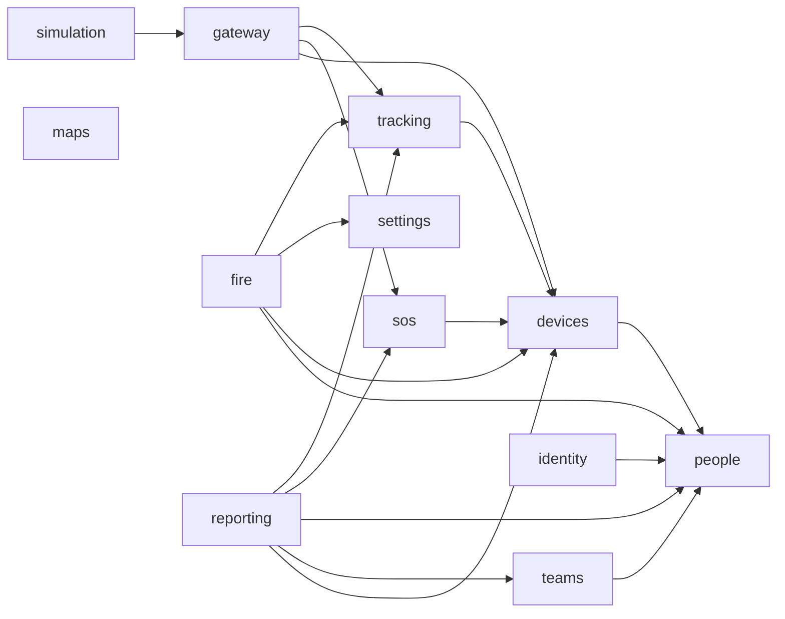

# Modular monolith: modules as vertical slices

**Version:** 0.1
**Status:** Draft. Section 3 (structure and module anatomy) was approved on 2026-10-05; Sections 4 to 10 follow
the decisions taken in the same session (Section 2) and wait for review.
**Last updated:** 2026-10-05
**Decisions:** [ADR 17](../decisions/0017-vertical-slice-modules.md),
[ADR 18](../decisions/0018-transactional-outbox.md), [ADR 19](../decisions/0019-architecture-tests.md)
**Builds on:** [ADR 6](../decisions/0006-modular-monolith-in-process-tasks.md) (one process),
[ADR 7](../decisions/0007-pg-notify-websocket-live-channel.md) (live channel),
[ADR 10](../decisions/0010-numbered-sql-migrations.md) (migrations),
[engineering standards](../technology/engineering-standards.md) (ES-11 to ES-17)

Mutable supporting document. It describes the target module structure of the backend and the frontend, how
modules talk to each other, how the boundaries are enforced, and how the code gets there step by step.

---

## 1. Goals

1. **Clear module boundaries so people and agents can work in parallel** without touching the same files.
2. **New modules are easy to add** (wind data, APRS, Meshtastic, AI situation report): a new folder plus one line
   in a list, without editing other modules.

Scope: backend **and** frontend, cut along the same modules. Out of scope: changing what the system does,
splitting into several processes (ADR 6 stays).

---

## 2. Decisions taken (2026-10-05)

| Topic | Decision |
|-------|----------|
| Goal | Clear separation for parallel work and easy new modules |
| Scope | Backend + frontend, same modules |
| Data access across modules | **Writes only by the owning module**; **reads may join** across modules only through explicit read models; cascades go through events, never a direct write into another module's table |
| Boundary enforcement | **Architecture tests** (as in EDynamix.ServiceHub with NetArchTest), run with `pytest` and `npm test` |
| Module anatomy | Layered: `module.py`, `api.py`, `http.py`, `domain/`, `infrastructure/`, `tasks.py` |
| Cascades between modules | **Transactional outbox** with idempotent handlers |
| Failure handling | Personal-data deletion: soft delete → every subscriber confirms → hard delete. Other events: dead letter, visible warning, manual retry |
| Real-time path | Positions, SOS and fire alerts never go through the outbox (Section 5.1) |
| Live payload | **Thin**: IDs and position data only; the browser joins names, teams and photos from data it already holds |
| Cache | Light, in-process, in `platform/`; no cache server |
| Module list | As in Section 4 |
| Migration | **Step by step with a ratchet**: architecture tests start with an allowlist of today's violations that may only shrink |

---

## 3. Structure and module anatomy (approved)

### 3.1 Backend

```
backend/
  main.py                ← assembly only: loads the module list, mounts routers, starts tasks
  platform/              ← shared kernel; knows no module
    config.py  db.py  auth.py  live.py (today's ws.py)
    outbox.py  cache.py  migrate.py  version.py  modules.py (manifest contract)
  modules/
    <name>/
      module.py          ← manifest: name, owned tables, router, tasks, subscriptions, live message types
      api.py             ← the ONLY entry point for other modules: commands, read models, event types
      http.py            ← FastAPI router
      domain/            ← pure logic: dataclasses and rules, no I/O, injected clock
      infrastructure/    ← SQL (repository), external clients (feeds, hardware)
      tasks.py           ← background tasks
  db/migrations/         ← one numbered sequence (ADR 10); each file names its module in the header
```

### 3.2 Frontend

```
src/
  platform/              ← api client, auth store, router, live (WebSocket), i18n core, map-shell
  modules/
    <name>/
      index.js           ← manifest: routes, nav, map layers, panels, banners, live handlers, i18n
      store.js  components/  views/  lib/  i18n/{en,bg}.js
```

### 3.3 Dependency rules

1. A module imports only `platform` and the **`api.py` / `index.js`** of another module, never its internals.
2. `domain/` does not import `infrastructure/`, `http.py`, `tasks.py`, `asyncpg`, `httpx` or FastAPI.
3. `platform` imports nothing from `modules`.
4. The module graph has no cycles and only the allowed directions of Section 4.2.
5. A module writes only to the tables listed in its manifest.

`main.py` and the map-shell read the module list; they do not name modules in code. Each module carries its own
`en.js` and `bg.js`; the platform merges them (the two large i18n files are a frequent conflict point today).

---

## 4. Modules

### 4.1 Catalogue

| Module | Owns (writes) | Does | Comes from |
|--------|---------------|------|------------|
| `identity` | nothing (reads `users` through `people.api`) | Login, refresh, me, `LOGIN_ROLES`, default admin | `auth.py`, `routers/auth.py`, `main.py` |
| `people` | `users`, photo files | Volunteers, photos, Excel import, passwords | `routers/users.py` |
| `teams` | `groups`, `user_groups` | Teams, members, leader | `routers/groups.py` |
| `devices` | `devices` | Device register, assignment | `routers/devices.py` |
| `gateway` | nothing | Hardware: HID and serial readers, frame parser, duplicate filter, ACK; calls `tracking` and `sos` | `hardware_reader/` |
| `tracking` | `location_events`, `repeater_events` | Store positions; live, trail, history; retention | `reader.py` (part), `routers/locations.py`, `main.py` |
| `sos` | `sos_alerts` | Open, list and resolve SOS | `reader.py` (part), `routers/locations.py` |
| `fire` | `fire_hotspots`, `fire_burnt_areas`, `fire_alerts`, `fire_suppression_zones` | Feeds, layers, alarms, zones, field reports | `fire/`, `routers/fire.py` |
| `settings` | `settings` | HQ, alarm radii, map display | `routers/settings.py` |
| `reporting` | nothing | CSV, GeoJSON, PDF through read models | `routers/export.py` |
| `maps` | tile files | Offline tile download, tile serving | `routers/tiles.py` |
| `simulation` | nothing | Test frames, development only; feeds `gateway`, never duplicates it | `routers/test.py` |

Frontend modules mirror these, plus `weather` (frontend only for now). The map itself is `platform/map-shell`.

Future modules slot in without changes elsewhere: `aprs` and `meshtastic` (gateway-like, call `tracking.api`),
`wind`, `assistant` (AI situation report, see [FC-01](../roadmap/fc-01-ai-assistant.md)).

### 4.2 Allowed dependencies



Arrows are calls to `api.py` (commands or read models). Reactions in the other direction (for example `fire`
reacting to a deleted person) go through events (Section 5.2), not imports. Every module may import `platform`.

---

## 5. Communication between modules (for review)

### 5.1 Fast path: positions, SOS, fire alerts

```
gateway ── parse, CRC, duplicate filter
   │
   ├─ one transaction ─────────────────────────────┐
   │  tracking.api.record_position(conn, ...)        │  INSERT location_events, pg_notify('location_update')
   │  sos.api.raise_sos(conn, ...)   (if SOS bit)    │  INSERT sos_alerts,      pg_notify('sos_alert')
   └─ COMMIT ───────────────────────────────────────┘  (NOTIFY is delivered only after commit)
   │
   ACK to the gateway (after the commit, ES-23)
   │
platform/live (LISTEN) ─► /ws ─► browser: module handler by message type ─► map-shell layer
```

Rules:

1. **Direct calls only.** No outbox, dispatcher or queue on this path. If the dispatcher stops, positions and SOS
   still arrive (BP-01, BP-02).
2. **Stored before shown.** `pg_notify` is sent inside the writing transaction and delivered after commit (ADR 7).
3. **ACK after the write** (ES-23, R-06). Changes here need validation on real hardware.
4. **One live channel.** `platform/live` forwards any registered channel as `{type, ...payload}`; it knows no module.
   Each module declares its live message types in its manifest.
5. **REST is the source of truth.** On reconnect each frontend module refetches its state (live positions, open
   alarms), so a missed message loses nobody.
6. **No subscribers on the fast path.** Modules that need positions (fire alarm targets, a future situation report)
   read the read model `tracking.api.latest_positions` on their own tick.

**Thin payload.** `location_update` carries `device_id`, `person_id`, position (lat, lon, MGRS), altitude, speed,
course, battery, satellites, `gnss_valid`, `sos_active`, `repeater_mode`, `recorded_at`, `received_at`. Names,
ranks, phones, photos and teams come from the frontend `people`, `teams` and `devices` stores. When those change, the
owning module sends a short `people_changed` / `teams_changed` / `devices_changed` message (IDs only) and the store
refetches. Side effect: phones and photo paths leave the open live channel (R-22).

### 5.2 Consistency path: transactional outbox

Used for **reactions and cascades** between modules, never for the fast path.

1. The owning module changes its data **and** inserts an event row into `outbox` in the same transaction.
2. `pg_notify('outbox')` wakes the dispatcher (a platform task) right after commit; a poll every 30 s is the
   fallback.
3. The dispatcher takes events with `FOR UPDATE SKIP LOCKED` and calls each subscribed handler in its own
   transaction.
4. **Idempotency:** a handler records `(event_id, handler)` in `inbox` in the same transaction as its work; a
   repeated delivery is a no-op. At-least-once delivery, effectively once processing.
5. **Retries** with backoff; after a fixed number of attempts the delivery moves to `dead_letter`.

**Event payloads carry IDs only**, never personal data (DP-02). Dispatched events and inbox rows are deleted after
a short retention (DP-03).

### 5.3 Failure handling and compensation

| Event kind | When a handler keeps failing |
|------------|------------------------------|
| **Deletion of personal data** (`PersonDeleted`) | The owner does a **soft delete** first (the person disappears from every screen and query). The **hard delete** (row and photo file) runs only when every subscribed handler has confirmed. Until then the deletion is "not finalised": the compensation is that the data is not destroyed half-way. |
| **Other events** | The delivery goes to `dead_letter`; an admin-visible warning appears (status endpoint and a live `platform_warning` message); retry on command. The owner's change stays. |

Failures are always visible (BP-03).

### 5.4 Initial event catalogue

| Event | Published by | Subscribers and reaction |
|-------|-------------|--------------------------|
| `PersonDeleted` | `people` | `tracking` clears `user_id` on positions; `sos` clears `user_id`, `resolved_by`; `fire` anonymises alerts, reports and zone actors; `devices` detaches the person; `teams` removes memberships; then `people` finalises (hard delete, photo file) |
| `PersonChanged` | `people` | Cache invalidation; live `people_changed` |
| `DeviceAssigned`, `DeviceChanged` | `devices` | Cache invalidation; live `devices_changed`; `fire` re-evaluates rescuer targets |
| `DeviceDeleted` (permanent) | `devices` | `tracking` deletes positions and heartbeats; `sos` deletes alerts; `fire` resolves the device's alerts under the alarm lock |
| `TeamChanged` | `teams` | Cache invalidation; live `teams_changed` |
| `SettingsChanged` | `settings` | Cache invalidation; `fire` re-evaluates |

Today these cascades are direct SQL from `routers/users.py` and `routers/devices.py` into other modules' tables.

### 5.5 Cache

- **In-process**, in `platform/cache.py`: small TTL caches with explicit invalidation. No Redis or Valkey: no extra
  process and only a few MB of RAM on the field laptop (TP-03).
- **Invalidated by `…_changed` notifications**, which `platform/live` also receives: one mechanism for the server
  cache and the browser stores.
- **Reads only:** read models such as the roster for the tracker list, fire alarm targets, settings. The fast path is
  never cached.
- **Used where measured.** With about 10 devices the load is small; a module adds caching only when a measurement
  (for example at the field exercise) shows the need.

---

## 6. Data ownership and read models (for review)

- Every table has exactly one owning module (manifest). Only the owner writes to it (ES-14).
- A **read model** is a query function (or SQL view) declared in the `api.py` of the module that needs the data,
  listed in its manifest with the foreign tables it reads. Examples: `tracking.api.latest_positions`,
  `reporting` export queries, `fire` rescuer targets. Read models are the only place where SQL joins another
  module's tables.
- Migrations stay one numbered sequence (ADR 10); the header of each file names the owning module, and the
  architecture tests check that a migration changes only that module's tables.

Schema changes this design needs (each through the migration reviewer): `outbox`, `inbox` and `dead_letter`
tables; a soft-delete marker on `users`.

---

## 7. Frontend: map-shell and module manifests (for review)

The map today lives in `MapView.vue` (1352 lines) and `useMap.js` (926 lines). The platform keeps only the
shell; modules contribute through their manifest:

| Extension point | Contributed by |
|-----------------|----------------|
| Map layers (with z-order and toggle button) | `tracking` (markers, trails), `fire` (burnt areas, hotspots, zones), `settings` (HQ marker), `maps` (basemaps), `weather` |
| Side panels | `tracking` (tracker list) |
| Alarm banners, ordered by priority (SOS above fire, BP-02) | `sos`, `fire` |
| Map context menu items | `fire` (report fire here) |
| Popups on feature click | `fire`, `tracking` |
| Live message handlers by type | every module with live data |
| Routes and navigation entries | every module with a page |

A new module adds its layer or banner without editing the map. Front-end file changes go through the design agent
(`CLAUDE.md`).

---

## 8. Architecture tests (for review)

Modelled on `EDynamix.ServiceHub.ArchitectureTests` (NetArchTest): rules written as tests, grouped into
**Layering** and **Convention**, run in the normal test suites, tagged like every other test.

| Rule | Backend (`backend/tests/architecture/`, pytest) | Frontend (`src/architecture.test.js`, vitest) |
|------|-------------------------------------------------|-----------------------------------------------|
| Modules import only `api` of other modules | pytest-archon rules | dependency-cruiser API inside a vitest test |
| `domain/` has no I/O and no framework | pytest-archon: no `asyncpg`, `httpx`, `fastapi`, no `infrastructure` | `lib/` pure: no `api`, no store imports |
| `platform` imports no module | pytest-archon | dependency-cruiser |
| No cycles; only allowed directions (Section 4.2) | graph test over the manifests | dependency-cruiser |
| Writes only to owned tables | SQL scan: `INSERT/UPDATE/DELETE <table>` matched against the manifest | — |
| Only `infrastructure/` runs SQL | scan for `conn.execute`/`fetch*` outside `infrastructure/` | — |
| Manifest is complete | every router, task and live type of a module is declared | every route and layer declared |

> ⚠️ **Requires technical clarification:** pytest-archon (fluent rules in test code, closest to NetArchTest) or
> import-linter (contracts in configuration, more widely used). The design needs only "module imports" and "layer
> imports" checks; either works. Pin the version (`requirements.txt` rule).

**Ratchet.** The tests start with an allowlist of today's violations, so they pass on day one. New code cannot add a
violation; each migration step removes its lines from the allowlist; the list may only shrink.

---

## 9. Migration plan (for review)

| Step | Content | Notes |
|------|---------|-------|
| 0 | `platform/` (move config, db, auth, ws → live, migrate, version) with old import paths kept as thin re-exports; manifest mechanism; architecture tests with the allowlist | No behaviour change |
| 1 | `settings` | Small leaf module; proves the template |
| 2 | `fire` (backend already close) + frontend map-shell with fire layers and banner as the first contributions | Largest frontend win |
| 3 | `tracking`, `sos`, `gateway` (fast path; thin payload) | **Touches the hardware path: validate on real hardware** |
| 4 | `devices`, `teams`, `people` + outbox, inbox, dead letter, soft delete, `PersonDeleted` | Needs migrations and the migration reviewer |
| 5 | `identity`, `reporting`, `maps`, `simulation`, `weather` | Allowlist empty at the end |

One module per pull request, backend and frontend together; each removes its allowlist lines; each passes the
breaker and, for security-relevant paths, the security reviewer. Order may change with the field exercise results.

---

## 10. Error handling and testing (for review)

- **Fast path:** a failure to store a frame means no ACK, so the device retransmits; logged with the reason (BP-01,
  ES-28).
- **Outbox:** failures retry, then dead letter with a visible warning; personal-data deletion stays soft until
  confirmed.
- **Module tests:** each module keeps its tests next to its code layer: pure `domain/` tests without a database,
  `infrastructure/` tests against a mocked connection or scratch database, `http.py` tests through the FastAPI
  test client.
- **Contract tests:** each `api.py` function and each event type has a test in the owning module; subscribers test
  their handler with a recorded event.
- **Architecture tests** as in Section 8.

---

## 11. Open questions

> ⚠️ **Requires stakeholder input (owner):** this restructuring touches every file; it should start after the EFFIS
> work is merged, and step 3 needs time with the real gateway.

> ⚠️ **Requires technical clarification:** tool choice for the backend architecture tests (Section 8).
